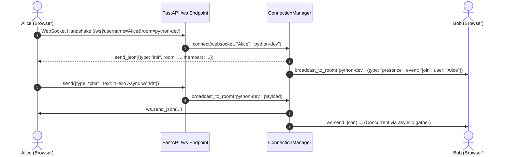

# 💬 Real-Time Multi-Room Chat with Presence

A high-performance real-time chat application built with **Python 3.14 Asyncio, FastAPI, and WebSockets**, featuring a modern **WhatsApp Web** interface.

---

## 🚀 Key Features

* **Multi-Room & Channels:** Instant switching between channels (`#general`, `#python-dev`, `#tech-talk`, `#random`) or creating custom rooms on the fly.
* **Live Presence Tracking:** Real-time online member count, join/leave system alerts, and participant drawer.
* **Typing Indicators:** Debounced real-time typing indicators (*"Alice is typing..."*).
* **WhatsApp Aesthetics:**
  * Outgoing/incoming message bubble design with timestamps & double-ticks.
  * WhatsApp wallpaper pattern & green signature accent headers.
  * Dark & Light theme switcher with local storage persistence.
  * Web Audio API synthesized soft audio notifications (zero external MP3 dependencies).
* **Asyncio Concurrency:**
  * Uses non-blocking `asyncio.gather` for simultaneous room-level broadcasts.
  * Heartbeat / Ping-pong mechanism every 25s to keep connections alive and healthy.
  * Resilient auto-reconnection on network drops.

---

## 🧠 Core Asyncio & WebSocket Architecture



### 1. Cooperative Multitasking with Asyncio
* FastAPI runs on an **Event Loop**.
* When a client sends a message, Python doesn't block waiting for sockets to write bytes sequentially.
* `asyncio.gather(*tasks)` concurrently delivers packets across all connections in the room.

### 2. State Management (`manager.py`)
* `active_connections: dict[WebSocket, dict]`: Maps each socket to user metadata (username, room, avatar).
* `rooms: dict[str, set[WebSocket]]`: Maps room slugs to sets of active WebSockets for $O(1)$ lookups and fast broadcasting.
* `typing_users: dict[str, set[str]]`: Tracks who is typing in each room.

---

## 📦 Getting Started

### 1. Requirements
* Python 3.10+ (tested with Python 3.14)

### 2. Install Dependencies
```bash
pip install fastapi "uvicorn[standard]"
```

### 3. Run the Server
```bash
python main.py
```
*Or using uvicorn CLI:*
```bash
uvicorn main:app --reload --port 8000
```

### 4. Open in Browser
Open `http://localhost:8000` in two different browser tabs (or an Incognito window) to test real-time chatting, typing indicators, and room switching across multiple users!

---

## 📂 Project Structure

```
fastapi-websockets-chat/
├── main.py              # FastAPI app, static mounts, and WebSocket router
├── manager.py           # ConnectionManager for state, presence, and broadcasts
├── static/
│   ├── index.html       # WhatsApp Single-Page App
│   ├── style.css        # WhatsApp UI styling & animations (Light/Dark mode)
│   └── app.js           # Client WebSocket controller & typing debouncer
└── README.md            # Architecture, Asyncio explanation, and instructions
```
